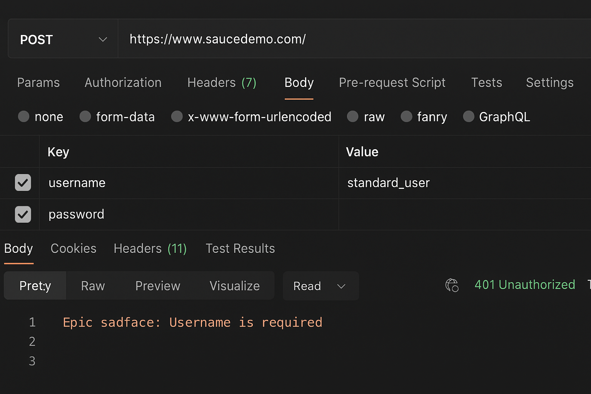
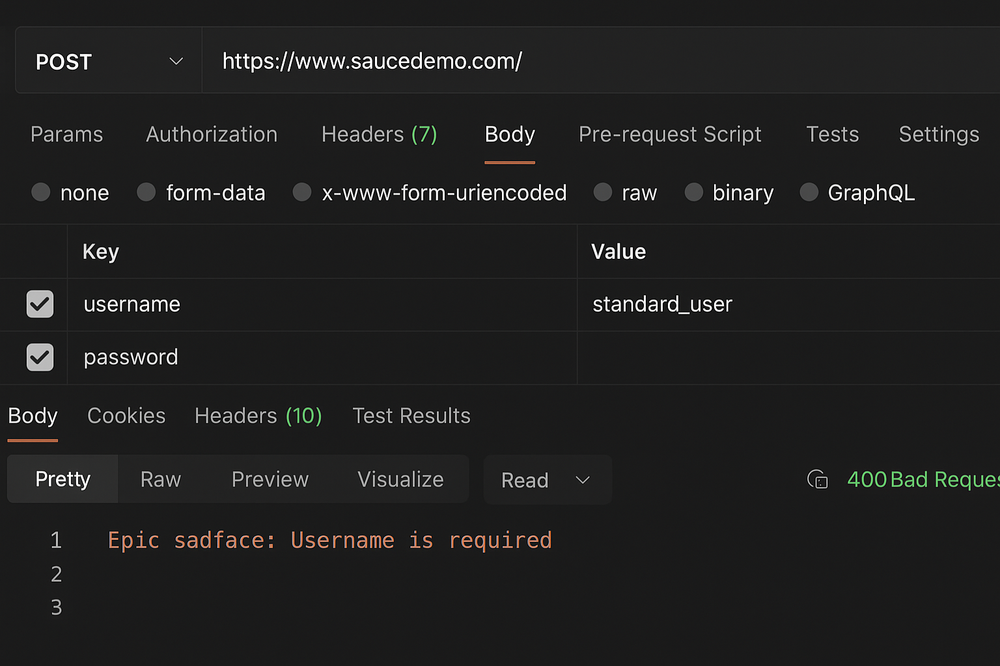

# UI Testing – SauceDemo Website

This project includes complete manual UI testing of the SauceDemo application.  
All functional areas were tested including Login, Products, Cart, and Checkout.

---

## 🔹 Website Under Test
https://www.saucedemo.com

## 🔹 Project Structure
- **TestCases/** – Full list of UI test cases  
- **BugReports/** – Documented bugs with severity/priority  
- **Screenshots/** – Evidence from testing  
- **TestPlan/** – Full test plan for the project  

---

## 🔹 Key Test Areas
- Login (positive & negative)
- Products list & sorting
- Add/Remove from cart
- Checkout flow
- Error handling

---

## 🔹 Tools Used
- Manual testing
- Browser DevTools
- GitHub for documentation

---

## 📸 API Test Screenshots

### 🟦 1) Screenshot – Test Result 1

---

### 🟩 2) Screenshot – Test Result 2

---
## 🔌 API Services (Postman Collection)

The **Services** folder contains the full Postman Collection used for API testing.

➡️ **[Download Postman Collection](Services/my_api_collection.json)**

After importing this JSON file into Postman, you will be able to test all API endpoints included in this project.

This collection contains:

- GET all items
- GET item by ID
- POST create new item
- PUT update existing item
- DELETE item
- Negative test scenarios

You can import the file in Postman through:
**Postman → Import → Select File → my_api_collection.json**

## 🔹 Tester
Created by **[narsis]**
